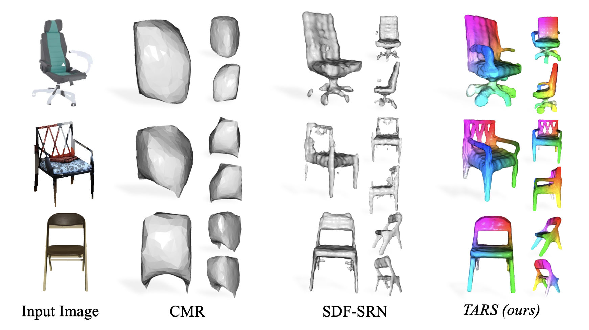
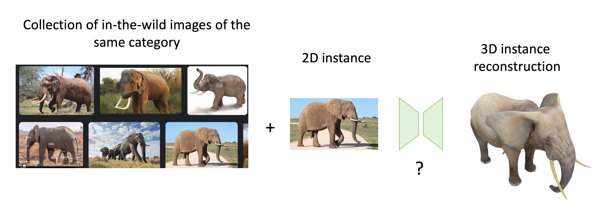
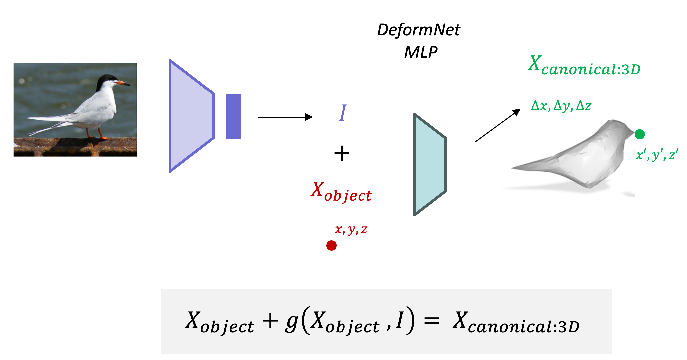
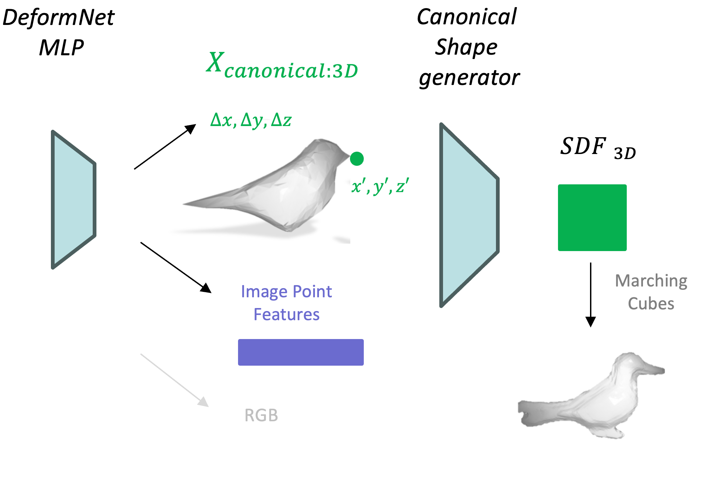
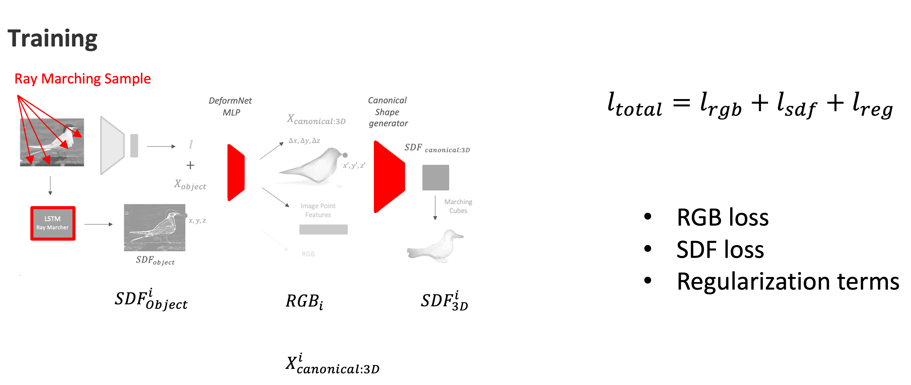
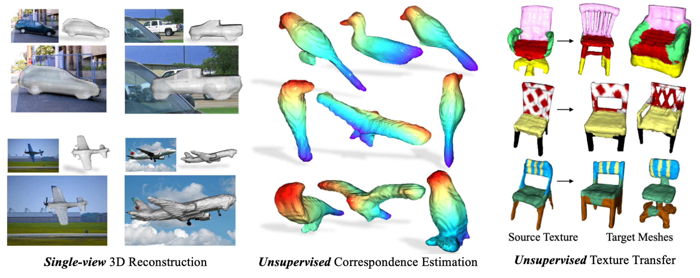
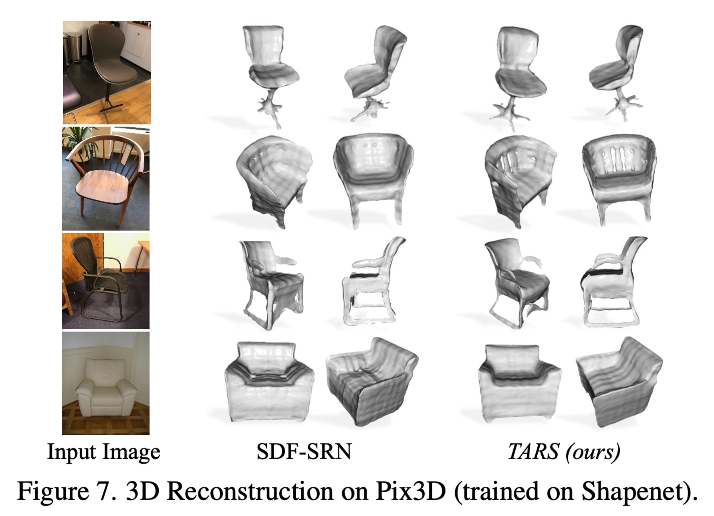
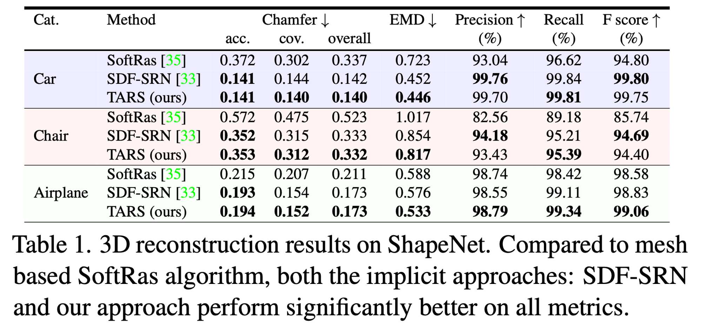

---

# __TARS__
## __Topologically-Aware Deformation Fields <br>for Single-View 3D Reconstruction__
*Paper Authors : Shivam Duggal, Deepak Pathak. Carnegie Mellon University.*

*CVPR2022*

[Link to Paper](https://doi.org/10.48550/arXiv.2205.06267)


[Link to Code](https://github.com/ShivamDuggal4/TARS3D)

*__Recent Trends in 3D Computer Vision - TUM - 2023__*

Blog author: Alejandra Castelblanco



___
___

## __Introduction__

__Context:__
There is a lack of scalable ways to obtain large amounts of data that map 2D to 3D representations of an object, even more for in-the-wild images on the internet. This type of data however, is  required to train most of the 2D to 3D rendering AI models.
<br><br>

This study adresses 3 questions:
- How can we understand the 3D geometric world from 2D observations?

- How to best represent a 3D Structure to obtain the best shape generation model?

- Can we exploit a collection of unmatched 2D images that belong to the same category to train the model?
<br><br>

__Aim:__ Given a single 2D image of an object, the goal is to propose a model that can reconstruct the corresponding 3D shape. 

__How__: This method leverages information from a collection of unpaired images from the same category, and builds an 'averaged' or 'canonical' representation of the shape of this category to make better 3D renderings.




___
__Requirements:__
In this work, the authors propose a model that estimates a 3D shape of an object from three inputs: 
- *(i)* A 2D image with a targeted object 
- *(ii)* A mask of the object location in the image
- *(iii)* Camera viewpoint


__Achievements:__

1. This work outperformed priors works in term of 3D reconstruction fidelity and generated 3D shapes with better global structure and finer instance-specific details. 
2. The method allows to learn 3D correspondence across instances of a category.
___
___

## __Previous Works__

- __Neural Rendering:__ Previous works have synthesized images from real world observations using various AI and classical computer graphics methods. This paper utilizes previous work on [Shape Representation Networks (SRN)](https://doi.org/10.48550/arXiv.1906.01618) as their AI-based renderer. 

- __Implicit Representations:__ Previous approaches have relied on 3D or multiview supervision for model training. They generally used meshed-based representations. For example see: [Learning Category-Specific Mesh Reconstruction from Image Collections](https://doi.org/10.48550/arXiv.1803.07549)

Most approaches don’t generalize to highly diverse topological variations in the same category and lack of fine instance details.

___
___
## __Methods__

### __Model Testing:__ 

There are two steps for making inferences: (A) Deformation Fields + Point Features, and (B) Canonical Shape Reconstruction.

#### __A. Deformation Fields + Point Features:__



- First, a pretrained ResNet autoencoder (AE) is used to condense the image information in a vector of features $I$ (shown in purple). 

- Second, coordinates of the object $X_{object}=[x,y,z]$ (shown in red), are sampled in the 2.5D representation of the image, via SRN. 

- Both representations are given to the DeformNet model $g(I + X_{object})$, to obtain a deformation field $(\Delta)$, and then $\Delta + x_{object}$ generates a point in the canonical shape representation: $X_{canonical:3D}=[x',y',z']$.

The Deformnet model also outputs: Image point features and RGB color estimations of the sampled point in the image.

#### __B. Canonical Shape Reconstruction__ 
Once we have deformed the 3D points in object space to the corresponding points in canonical space, our next task is to learn the 3D shape in form of SDF field. 

The canonical shape generator takes the points from the canonical space and the point features, to find the signed distance value of the final object. They utilize marching cubes to generate a 3D mesh from the learned SDF field



### __Model Training__
In addition, at the time of training there is an additional step to be understood:

#### C. Differentiable Renderer Module
The differentiable renderer is used to generate 2D renderings of the learned 3D shape during training, which are then compared against input object’s GT 2D observations.

The training objective is defined as a loss for color, a loss for sdf representation and a regularization term: $l_{total} = l_{rgb}+l_{sdf}+l_{reg}$



___
___

## __Results__
Evaluation was performed on the following datasets: Shapenet, Pascal3D+, CUB-200-2011 and Pix3D chairs.

Baselines considered to compare the method were: 
- SoftRas: rasterization-based differentiable mesh renderer.
- SDF-SRN: neural implicit modeling approach for single-view reconstruction. 
- CMR: deformation driven mesh reconstruction approach.

### Qualitative Results:
TARS reconstructions are (1) much less noisier
(2) respect the topology of the underlying shapes
(3) better captures global shape and finer details
(4) learns cross-instance structural correspondences.



The model can also extrapolate from training on a synthetic dataset to real world dataset images.



### Quantitative Results:



___
___
## __Conclusions__

Their approach can learn to reconstruct 3D shapes, given a category collection of unpaired 2D images.

- They achieved high fidelity reconstruction of the global structure and fine topological details. 
- The deformation field network in combination with point-based-features learns the category-specific structural relations (e.g., base of a sofa as equivalent to legs of a chair) without supervision. 

Main shortcomings of the method: Needs the GT of the camera pose for training (difficult to obtain) and the mask of the object (easier).

___
___

## h2 Heading
### h3 Heading
#### h4 Heading
##### h5 Heading
###### h6 Heading


## Horizontal Rules

___

---

***


## Typographic replacements

Enable typographer option to see result.

(c) (C) (r) (R) (tm) (TM) (p) (P) +-

test.. test... test..... test?..... test!....

!!!!!! ???? ,,  -- ---

"Smartypants, double quotes" and 'single quotes'


## Emphasis

**This is bold text**

__This is bold text__

*This is italic text*

_This is italic text_

~~Strikethrough~~


## Blockquotes


> Blockquotes can also be nested...
>> ...by using additional greater-than signs right next to each other...
> > > ...or with spaces between arrows.


## Lists

Unordered

+ Create a list by starting a line with `+`, `-`, or `*`
+ Sub-lists are made by indenting 2 spaces:
  - Marker character change forces new list start:
    * Ac tristique libero volutpat at
    + Facilisis in pretium nisl aliquet
    - Nulla volutpat aliquam velit
+ Very easy!

Ordered

1. Lorem ipsum dolor sit amet
2. Consectetur adipiscing elit
3. Integer molestie lorem at massa


1. You can use sequential numbers...
1. ...or keep all the numbers as `1.`

Start numbering with offset:

57. foo
1. bar


## Code

Inline `code`

Indented code

    // Some comments
    line 1 of code
    line 2 of code
    line 3 of code


Block code "fences"

```
Sample text here...
```

Syntax highlighting

``` js
var foo = function (bar) {
  return bar++;
};

console.log(foo(5));
```

## Tables

| Option | Description |
| ------ | ----------- |
| data   | path to data files to supply the data that will be passed into templates. |
| engine | engine to be used for processing templates. Handlebars is the default. |
| ext    | extension to be used for dest files. |

Right aligned columns

| Option | Description |
| ------:| -----------:|
| data   | path to data files to supply the data that will be passed into templates. |
| engine | engine to be used for processing templates. Handlebars is the default. |
| ext    | extension to be used for dest files. |


## Links

[link text](http://dev.nodeca.com)

[link with title](http://nodeca.github.io/pica/demo/ "title text!")

Autoconverted link https://github.com/nodeca/pica (enable linkify to see)


## Images


Like links, Images also have a footnote style syntax

![Alt text][id]

With a reference later in the document defining the URL location:

[id]: https://octodex.github.com/images/dojocat.jpg  "The Dojocat"


## Plugins

The killer feature of `markdown-it` is very effective support of
[syntax plugins](https://www.npmjs.org/browse/keyword/markdown-it-plugin).


### [Emojies](https://github.com/markdown-it/markdown-it-emoji)

> Classic markup: :wink: :crush: :cry: :tear: :laughing: :yum:
>
> Shortcuts (emoticons): :-) :-( 8-) ;)

see [how to change output](https://github.com/markdown-it/markdown-it-emoji#change-output) with twemoji.


### [Subscript](https://github.com/markdown-it/markdown-it-sub) / [Superscript](https://github.com/markdown-it/markdown-it-sup)

- 19^th^
- H~2~O


### [\<ins>](https://github.com/markdown-it/markdown-it-ins)

++Inserted text++


### [\<mark>](https://github.com/markdown-it/markdown-it-mark)

==Marked text==


### [Footnotes](https://github.com/markdown-it/markdown-it-footnote)

Footnote 1 link[^first].

Footnote 2 link[^second].

Inline footnote^[Text of inline footnote] definition.

Duplicated footnote reference[^second].

[^first]: Footnote **can have markup**

    and multiple paragraphs.

[^second]: Footnote text.


### [Definition lists](https://github.com/markdown-it/markdown-it-deflist)

Term 1

:   Definition 1
with lazy continuation.

Term 2 with *inline markup*

:   Definition 2

        { some code, part of Definition 2 }

    Third paragraph of definition 2.

_Compact style:_

Term 1
  ~ Definition 1

Term 2
  ~ Definition 2a
  ~ Definition 2b


### [Abbreviations](https://github.com/markdown-it/markdown-it-abbr)

This is HTML abbreviation example.

It converts "HTML", but keep intact partial entries like "xxxHTMLyyy" and so on.

*[HTML]: Hyper Text Markup Language

### [Custom containers](https://github.com/markdown-it/markdown-it-container)

::: warning
*here be dragons*
:::
